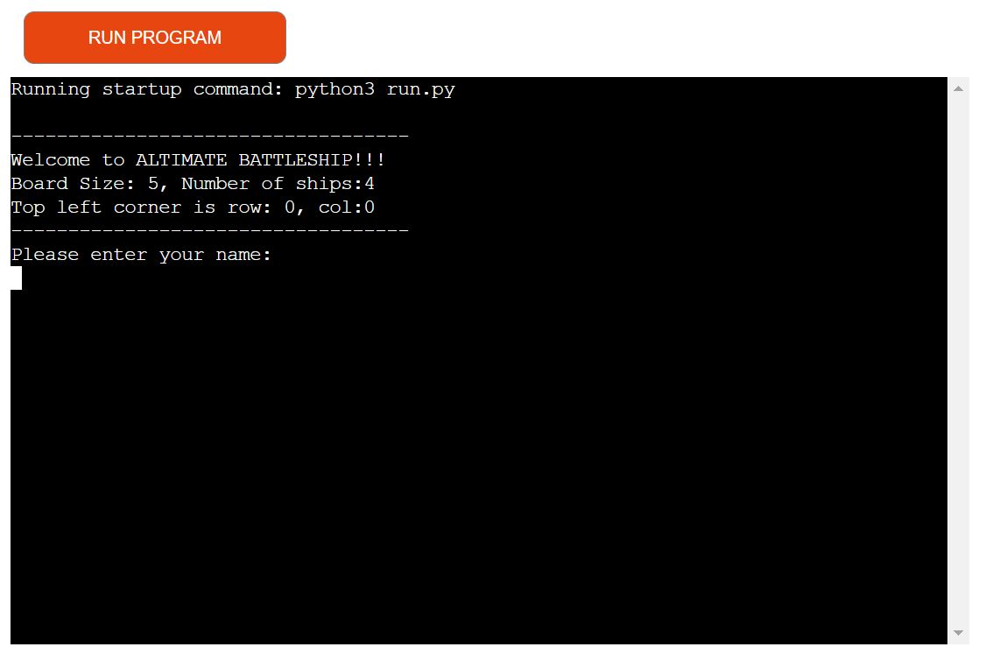

<h1>altimatebattleship</h1>

A Python programing languege game that is all about hitting the ships of your oponent while your openent is also trying to do the same thing,hitting your ships.

<h1>How is it played</h1>

 The player need to enter their name and press enter and two boards will be randomly generated.  The player will be able to see their ships, labelled by @ sign.  The player will not be able to see the oponents ships, ie. the computer's in this case.   Guesses are marked by X for a miss and by * for a hit.  The player and  the computer will take turns in trying to locate the openents ship.  Tha one that will manage to kill all of the oponents sheep will win. otherwise the game will need to be restarted after four attempts.

<h1>Features</h1>
<h2>Landing Page</h2>

 The Orange RUN PROGRAM button is used to start or restart the game when it is finished. When pressed the user will be welcomed advised of the board size of 5 by 5 and number of ships which is kept at 4, and the fact that the top left most corner would be row 0 column 0 and then the user will be prompted to ender their name.

<h2>The Game Boards</h2>

Ships positions are randomly generated on both the computer's board and the player's board, vee's board in this example. Compare with the next board and see that the ships are indeed randomly generated as they are not placed at the sameplace if you rerun the program with the run program button. It is interesting again to note that only the player's ships are visible to the player. The Player's ships are dipicted by the @, as already discrible on how it is played above paragraph above.  The player can not see the computers's ships she or he has to gues them, that is the game

<h2>Missed Ship</h2>

Once the user has entered their name, they will be asked to enter their number twice in a row, the first number will be their row and the second number will be their column. In this example the user picked 0 followed by 1 meaning he or she is guesing the computer's ship is hiddin at row 0 column1. This is shown back to the user as coordinate (0,1) additionally the player is advised that he is missed in this case.  He is also advised of the computer's shot, in this case the computer guessed the player's ship to be hidden at row 2 column 1, i.e. coordinate (2,1) which was also a miss for the computer. Lastly the scores after this round are shown.The misses are marked with X as it has already been explained in how it is played.

<h2>Computer Hitted Ship</h2>

See that when player's ship is hit then the @ changes to *, this way the play can see how many ships are still alive. The massage will advise that the computer hitted and player missed and also showing coordinates and the updated score after the round. In this case the computer has 1 and vee hass 0. Since the computer correclty guessed the player's ship to be hidding in row 4 column 4 i.e. coordinate (4,4) meanwhile vee misse's as he incorrectly guessed (2,2) and none of the computer's ship are hidding there.

<h2>Player Hitted Ship</h2>

See that also when the player hit he also get advised that he hit, the coordinates are confirmed back and the scores are updated accordingly. In this case player,vee guessed the computers' ship to be hidding at row 4 and column 4 ie coordinate (4,4) wich was one of the computer's ship's hidding spot. 

<h1>Input Validation and Error-checking</h1>
<h2>Not A Number!</h2>

See that when a player enters something other than a number,tee, in this case, an error message is returned letting the user that what they entered is not a number, they need to enter numbers between 0 and 4. 

<h2>Out of Range!</h2>

See that when a player enters a coordinate that is outside the board,like 99 or 5 as in this case, they receive an error message letting them they are out of range, they need to puck numbers between 0 and 4.

<h2>Avoid Duplicates!</h2>

See that when a player enters a coordinate that has already been entered, in this case (2,2), the player will get the error message that the guess was already made she or he must try again.

<h1>Data Model</h1>

The game has two instances of the board class to keep player's and the computer'sboard.   The Board class keeps the board size, the number of ships, the posistion of the ships, the guesses against that board, and the details of the board type may be a competer's board or the player's board and the plyer's name is kept.

<h1>Bugs<h1>

No time to figute out the error handling of a string instead of a number. Lost many days due to Mall functioning of Codes spaces infrastructure<\p>

<h1>References<h1>

Anna Greaves
The code is inspired by the Love Sandwiches Code Institute walkthrough Project videos delivered by Full Stack Web developer and content creator, Anna Greaves.

Matt Rudge
The CSS code on the footer was partly taken from the battle ships game walk through project presented by Matt Rudge, Senior Product Developer at code institude.